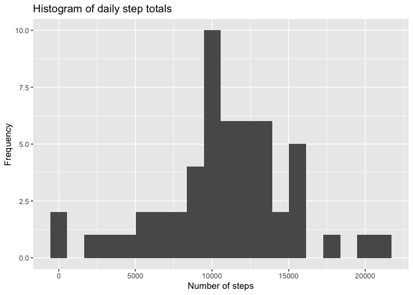
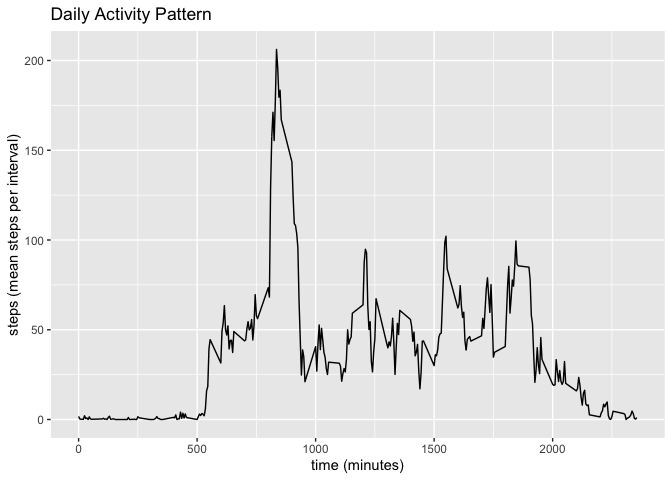
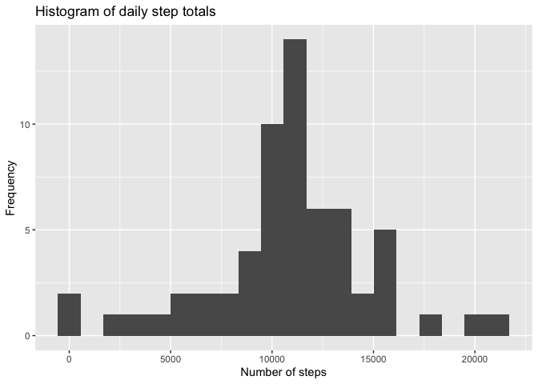
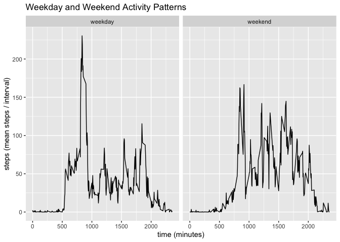

## Loading and preprocessing the data
The zipped data set is unzipped, read, and stored in the **all.data** dataframe 

```r
all.data <- read.csv(unzip("./activity.zip"))
```

Packages required for the analysis are loaded.

+ *dplyr* to manipulate data frames
+ *ggplot2* to plot data
+ *lubridate* to work with dates


```r
library(dplyr)
library(ggplot2)
library(lubridate)
```


## What is mean total number of steps taken per day?
The **all.data** dataframe is first grouped by the date variable,
then the summarize function is used to calculate daily step totals (**daystep**).
The resulting dataframe is called **day.data**

```r
day.data <- group_by(all.data, date) %>%
  dplyr::summarize(daystep = sum(steps))
```

A histogram of daily step totals is generated from **day.data** 

```r
qplot(daystep, data = day.data, 
      ylab = "Frequency", 
      xlab = "Number of steps", 
      main = "Histogram of daily step totals",
      bins = 20)
```

<!-- -->


```r
mean1 <- format(mean(day.data$daystep, na.rm = TRUE), digits = 7)
median1 <- format(median(day.data$daystep, na.rm = TRUE), digits = 7)
```
The mean and median daily step totals are 10766.19 and 10765 steps respectively.

## What is the average daily activity pattern?
The **all.data** dataframe is first grouped by the interval variable,
then the summarize function is used to calculate interval step totals averaged over all days (**intstep**).
The resulting dataframe is called **int.data**

```r
int.data <- group_by(all.data, interval) %>% 
    dplyr::summarize(intstep = mean(steps, na.rm = TRUE))
```

The average steps per interval are plotted here:

```r
qplot(interval, intstep, data = int.data, geom = "line",
      main = "Daily Activity Pattern", 
      xlab = "time (minutes)",
      ylab = "steps (mean steps per interval)")
```

<!-- -->


```r
max <- int.data[int.data$intstep == max(int.data$intstep), ]
```
Maximal average step count is 206.1698113 and is observed at 835 minutes

## Imputing missing values

```r
missing <- sum(!complete.cases(all.data))
```
**all.data** contains many missing values... in fact, 2304 rows are incomplete!

Missing values occur exclusively in the steps column.

```r
colSums(is.na(all.data))
```

```
##    steps     date interval 
##     2304        0        0
```

I have opted to "patch" missing values with the step count averaged over all days for the corresponding interval.
To do this, I first create a new dataframe **fill.data** where NA values will be replaced.
A column with interval averages is added, called **patch**.

```r
fill.data <- mutate(all.data, patch = ave(steps, interval, FUN = function(x) mean(x, na.rm = TRUE)))
```

The rows with NA values are identfied; row refs are stored in **napatch**.
These values are replaced with mean interval step values from the **patch** column

```r
napatch <- which(is.na(fill.data$steps))
fill.data$steps[napatch] = fill.data$patch[napatch]
```

The rest of the analysis follows the same approach as for **all.data**, as described at the beginning of this document.
In short, **fill.data** is grouped by date and daily totals are calculated, creating a new data frame, **day.fill.data**.

```r
day.fill.data <- group_by(fill.data, date) %>%
  dplyr::summarize(daystep = sum(steps))
```

This data is plotted here:

```r
qplot(daystep, data = day.fill.data, 
      ylab = "Frequency", 
      xlab = "Number of steps", 
      main = "Histogram of daily step totals",
      bins = 20)
```

<!-- -->


```r
mean2 <- format(mean(day.fill.data$daystep), digits = 7)
median2 <- format(median(day.fill.data$daystep), digits = 7)
```
The mean and median daily step totals are 10766.19 and 10766.19 steps respectively.

## Are there differences in activity patterns between weekdays and weekends?
From the NA-free **fill.data**, a new dataframe with a column for the day of the week (**dow**) is created, called **wk.data**.
An additional column, **wktime**, reports on whether the day in **dow** is a weekday or weekend.
**wktime** was created by replacing "weekday" with "weekend" for rows in which the **dow** variable was "Saturday" or "Sunday"

```r
wk.data <- mutate(fill.data, dow = weekdays(ymd(fill.data$date))) %>% 
    mutate(wktime = "weekday")
wkend.r <-grep("Saturday|Sunday", wk.data$dow)
wk.data$wktime[wkend.r] = "weekend"
```

The **wk.data** dataframe is grouped by the **wk.time** variable.
The mean step count (**meanstep**) is calculated using the summarize function.
The resulting dataframe is called **wk.plot**

```r
wk.plot <- mutate(wk.data, wktime = as.factor(wktime)) %>%
    group_by(interval, wktime) %>%
    dplyr::summarize(meanstep = mean(steps))
```

Here is a panel plot of weekday and weekend activity patterns:

```r
qplot(interval, meanstep, data = wk.plot, facets = .~wktime, geom = "line",
      main = "Weekday and Weekend Activity Patterns", 
      xlab = "time (minutes)",
      ylab = "steps (mean steps / interval)")
```

<!-- -->
